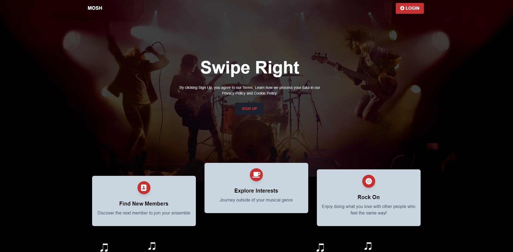
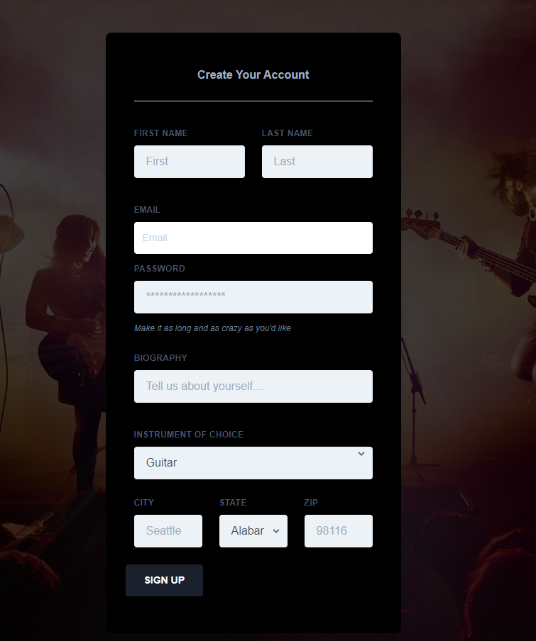
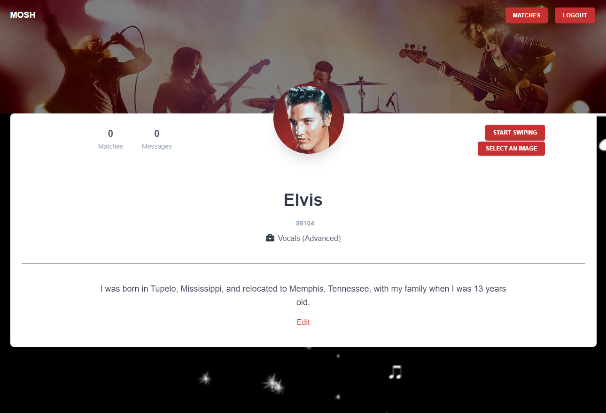
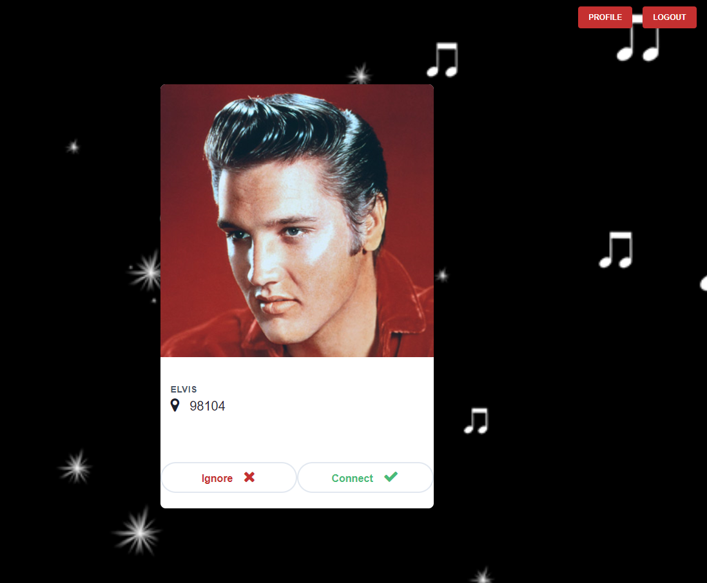
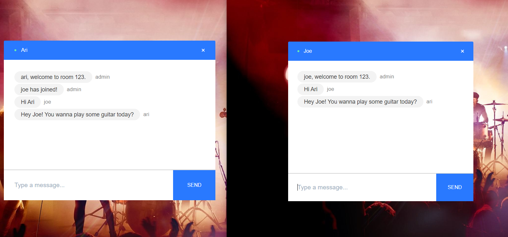

# Mosh - Social Networking site for musicians and vocalists

On this platform, musicians and vocalists socialize. Our vision is that they can chat, form a band, and in the future do a virtual tryout. Our project got some inspiration from Tinder. Currently, there is no platform that offers a similar idea for musicians. There are many use cases. For example, a band member is unavailable for an upcoming show and the band needs a quick replacement. Another, musicians can form a band with different skill sets.

This project was started out as a group project for the bootcamp that I completed at University of Washington. However, since there is a lot that needs to be implemented, fixed and stabilized, I will continue improving it on my own. You can try it at https://moshsocial.herokuapp.com/.

## What the application does

### Sign up and login
A user signs up with the site with basic info that includes first and last names, email address, password, a catch phrase or bio, instrument that they play, zip code, city and state. After the signup, the user can then login to the site with their email and password. Don't worry, passwords are stored as encrypted with BCrypt. Once logged in, a session cookie is good for two hours.

### Profile Page
If successful, a personal profile card is generated dynamically. The profile card displays the number of matches and offline messages. On the profile card, the user can upload their photos and edit the catch phrase. Finally, the user can start checkout other profiles by clicking "Start Swipe" button.

### Swipe Card
Swipe cards are generated for new users that the user hasn't seen. The user can either click buttons or swipe with their mouse or finger on a phone or touch screen device. If dislike, the user swipes a swipe card to the left and vice versa. If two users swiped right (like) on each other, a match is created.

### Chat
At the moment, users can go to https://moshsocial.herokuapp.com/chat/join link to join a chat by specifying a username and the room that the parties agreed on. The room can accomodate many people. In the future, I'd like to extend the messaging to conferencing so that musicians can start playing and singing. Obviously, a lag will be an issue if the connection is not excellent. 

## How it was made
* JavaScript and Node.js
* Google Materialize CSS Framework
* React
* create-react-app for skeleton
* Functional components with states and hooks
* React Spring for swiping
* Socket for real-time communication
* React router for route switching
* Express and HTTP servers
* BCrypt to hash passwords
* Express session to manage session and cookie
* MySQL to store data
* Sequelize as ORM
* Rest API
* MVC paradigm to organize the project
* Cloudiinary to store profile images
* Heroku to deploy production
* Github for branching, rule for code review and kanban board and project management

### Splash Screen

***

### Sign Up Page

***

### Profile Page

***

### Swipe Card

***

### Chat

***
